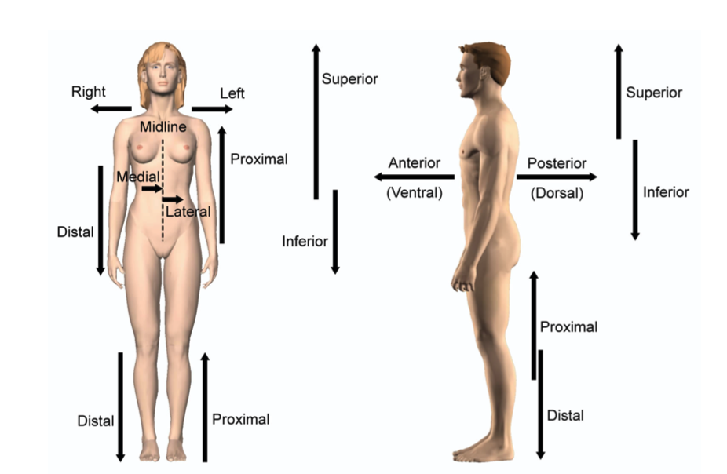

# Objectives

#### Define the terms “anatomy” and “physiology.”

* Anatomy: study of the body's structure

* Physiology: study of the body's function

#### Explain the levels of structural organization that create the human body.

* Chemical

* Cellular
* Tissue
* Organ
* Organ system
* Organism

#### Identify the distinct systems of the human body and their general functions.

* Skeletal: protects and supports organs; provides framework

* Integumentary: external covering, protects deeper structures
* Muscular: movement, posture, heat
* Nervous: respond to sensory info, coordinate body responses
* Endocrine: glands produce hormones that control body fxns
* Cardiovascular: heart pumps blood; vessel transport to cells; deliver nutrients and clear waste
* Respiratory: supplies blood with O2 and removes CO2
* Digestive: breaks down food into nutrition for cells
* Urinary: eliminates waste, controls water balance
* Reproductive: produces offspring
* Lymphatic: defends against infection and disease

#### List the six most important life processes in the human body.

* Maintaining boundaries (internal environment)

* Moving
* Responding to environment
* Taking in and metabolizing (using) nutrients
* Disposing of waste (excretion)
* Reproducing and growing

#### Analyze the condition of homeostasis and its influence on bodily fluids and disorders of the body.

* Receptor > Control Center > Effector --> Maintain homeostasis

* When body temperature drops, the nerves (receptors) in the skin send a signal to the brain (control center) which in turn sends a signal to the muscles (the effector) to shiver and produce heat, thus moving the body towards homeostasis
* Dynamic equilibrium: disturbances will cause the body to deviate from the set point (equilibrium), which will engage homeostatic (usually negative) feedback mechanisms to move the body towards it's normal parameters
* Negative feedback: the body negates or opposes a change in state. Example: body temperature.
* Positive feedback: the body reinforces or encourages a change in state. Usually control infrequent events. Examples: labor contractions during birth, blood clotting. Once started, these events should be reinforced for a time.
* Homeostatic imbalance: disturbance in homeostasis which often results in a diseased state.

#### Name the regions of the body and the directional terms that people use to discuss the body.

* Anatomical position: standing, hands at sides, palms facing forward, feet together

* Directional terms (relative to anatomical position)
  * Superior: towards head
  * Inferior: towards feet
  * Ventral: towards the front
  * Dorsal: towards the back
  * Anterior: towards the front
  * Posterior: towards the back
  * Medial: towards the midline
  * Lateral: away from the midline
  * Intermediate: between a medial and lateral structure
  * Proximal: close to the origin of the limb's attachment point
  * Distal: farther from the origin of the limb's attachment point
  * Superficial: towards the surface
  * Deep: away from the surface

#### Evaluate the importance of medical imaging in studying and diagnosing the body.
